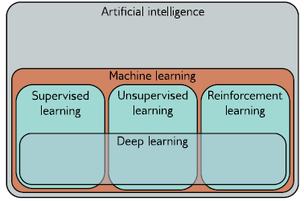

# Using CNN (Convolutional Neural Network) to Classify Images of Big Cats
Prepared By: Kiana Villaera

## Abstract

Currently, there are 1 million animal and plant species at risk. In the next 20 years, these animal and plant species face the risk of extinction. This is a direct consequence of the hyper-consumeristic world that we currently live in. For a while, humans have lost sight of one of the cornerstones of humanity: respect for the environment. Hence, the study aims to augment efforts in wildlife preservation by using image classification driven by CNN to help organizations maintain the ecological balance in their locales.

The research uses a dataset composed of images of wild cats of 10 different classes. MobileNetv2 was used as a backbone for the model. With a PCC of 12.5%, the model was able to beat the baseline by presenting a 70% validation accuracy. After hyperparameter tuning, the final model architecture is as follows:

* MobileNetV2 layer
* Global Average Pooling 2d
* Dropout
* Dense layer

Further recommendations include:

1. Do data augmentation by randomly generating images with different orientations from the original dataset
2. Try other backbones such as EfficientNet
3. Do fine-tuning by unfreezing the pretrained features and training with a very low learning rate

## Problem Statement

The problem statement is to train a lightweight model that is efficient in resource-constrained environments to successfully classify images of big cats. Accuracy is important in this context, but emphasis is placed on making sure that the model itself is lightweight and performs efficiently in mobile environments, which explains the choice to use MobileNetV2 as a backbone. The idea is that we want to enable fast and efficient classification on mobile devices--which allows on-the-fly inference in various wildlife-rich areas.

## Methodology

There are many state-of-the-art architectures out there like:
* **ResNet** a popular architecture that uses residual connections to enable training of very deep networks.
* **Inception** uses multiple parallel convolutions at different scales to capture fine-grained details in images.
* **Xception** a variant of Inception, uses depthwise separable convolutions to reduce computational complexity while maintaining accuracy.
* **MobileNet** is another efficient architecture that is designed for mobile and embedded devices.
* **EfficientNet** is a recent architecture that achieves state-of-the-art performance by automatically scaling up the network's depth, width, and resolution.

However, in this notebook, we want to come up with our own model architecture that can beat a baseline model. We can just use **transfer learning** and pick up a SOTA backbone and fine-tune it as seen in the reference notebook. The exact parameter for this notebook is to come up with a **relatively light-weight yet well-performing image classification model**.

Much of the other content in this notebook [references this notebook](https://www.kaggle.com/code/misski/big-cats-classification-acc/edit).

### Specific Implementation Steps:
1. Establish a baseline by training the barest possible CNN model
2. Establish another baseline by training the barest possible CNN model with MobileNetV2 as a backbone
3. Use randomsearch to tune the hyperparameters
4. Train a model using the best configuration
5. Evaluate model performance on accuracy
6. Run some predictions

### PCC

We will use 1.25PC / **12.5%** as a baseline for model performance. Once we beat the 1.25PCC, we can say that we've made a meaningful improvement.

## Results and Recommendations

By using transfer learning, we were able to achieve good results with a relatively minimalistic model architecture. On top of that, the backbone used is SOTA and intended for resource-constrained environments. This proves that we can achieve good results without having to expend an enormous amount of computational resources. In particular, the metrics are as follows:

* Accuracy: 0.7
* Precision: 0.73
* Recall: 0.7
* F1-Score: 0.66

Because precision measures the proportion of true positives among predicted positives, we are getting the right classifications 0.73 of the time. Recall measures the proportion of true postiives among all actual positives, so we are getting most of the actual positives. An F1-score of 0.66 indicates that the model is both precise and recalling most of the actual positives.

Some recommendations include:
1. Do data augmentation by randomly generating images with different orientations from the original dataset
2. Try other backbones such as EfficientNet
3. Do fine-tuning by unfreezing the pretrained features and training with a very low learning rate

## Preliminaries

In this section we go through the fundamental knowledge needed to understand how CNN and neural networks in general work. This might be an eyeful but it's necessary for those of us who are only starting out in deep learning.

### What are deep neural networks?
A deep neural network is a type of machine learning model, and when it is fitted to data, this is referred to as deep learning.[[1]](https://udlbook.github.io/udlbook/) We are primarily interested in the weights that result from model training. That's what model checkpoints with a .h5 extension refer to.

**Figure 1: AI/ML/DL body of knowledge**

Deep neural networks can process inputs that are very large, of variable length, and contain various kinds of internal structures. They can output single real numbers (regression), multuple numbers (multivariate regression) or probabilities over two or more classes (binary and multiclass classification)[[1]](https://udlbook.github.io/udlbook/). 

**Figure 2: High level overview of DNN**

### The Basic Idea Behind Neural Networks

**Figure 3: Visualization of a Simple Classifier Taken From [Tensorflow Playground](https://playground.tensorflow.org/#activation=relu&batchSize=20&dataset=xor&regDataset=reg-plane&learningRate=0.1&regularizationRate=0.1&noise=0&networkShape=4,4&seed=0.91964&showTestData=false&discretize=false&percTrainData=50&x=true&y=true&xTimesY=false&xSquared=false&ySquared=false&cosX=false&sinX=false&cosY=false&sinY=false&collectStats=false&problem=classification&initZero=false&hideText=false)**

The basic idea is that you have an $X$ amount of features, which you then feed to an $N$ amount of hidden layers wherein each layer contains an $n$ number of neurons. Each neuron takes in multiple inputs from the previous layer and calculates a value given weights $w$ and biases $b$, and that output is fed to each neuron in the next hidden layer. After all the hidden layers have been gone through, you get an output based on all the computed weights. In the case of image classification, whatever output you get from the last layer will tell you what class the image belongs to. That output is computed through the hidden layers.

There are many other elements to a neural network, such as the use of activation functions, regluarization, learning rates, and more.

#### Terminology

* Any neural network with at least one hidden layer is called a **multi-layer perceptron**.
* Networks with only one hidden layer are termed **shallow neural networks**.
* Networks with multiple hidden layers are referred to as **deep neural networks**.
* Neural networks in which the connections form an acyclic graph are referred to as **feed-forward networks**.
* If every element in one layer connects to every element in the next, the network is said to be **fully connected**.

### Activation Functions

An activation function in a neural network is a function that decides based on the output of the previous neuron, what output to be sent to the next neuron. So in a sense it decides whether to "activate" a neuron or not. They impose a range to the values being fed to the neurons. There are several different types of activation functions, but ReLU is one of the most common ones. The equation is given below:

$$
ReLU(x)=
\begin{cases}
    0 & \text{if } x < 0 \\
    x & \text{if } x \geq 0
\end{cases}
$$

This means that we return the input if it's positive, otherwise we return 0. Activation functions are important because since it imposes a range of the inputs to the neurons. Depending on the problem, we want to limit the range of our values to avoid computational issues. Additionally, they add non-linearity. Without activation functions, the neural network is nothing more than a stacked linear regression model that cannot learn complex patterns. After each layer, we apply an activation function that applies a nonlinear transformation. Please see [dying ReLU problem](https://datascience.stackexchange.com/questions/5706/what-is-the-dying-relu-problem-in-neural-networks).

Other popular activation functions include:
* Step function
* Sigmoid
* TanH
* Leaky ReLU
* Softmax

When we pass the data through the network, the values of the inputs to the hidden layer are termed **pre-activations**. The values at the hidden layer are termed **activations**[[1]](https://udlbook.github.io/udlbook/)

### Loss Functions

A loss function returns a single number that describes the mismatch between the model predictions and their corresponding ground-truth outputs. During training, we seek parameter values that minimize the loss and hence map the training inputs to the outputs as closely as possible.

In Tensorflow, we have the following possible loss functions:

#### Probabilistic Loss Functions
* Binary Cross-Entropy Loss - typical for binary classication
* Categorical Cross-Entropy Loss - typical for multiclass classification problems
* Sparse Categorical Crossentropy Loss - when the input labels are not integers
* Poisson Loss
* Kullback-Leibler Divergence Loss

### Illustration of how computations are done in DNN

**Figure 4: Illustration of how DNN computes values through layers**

### Explicit Regularization

Regularization reduce the generalization gap between training and test performance. It inolbes adding explicit terms to the loss function that favor certain parameter choices. The most commonly used regularization term is the **L2 norm** which penalizes the sum of the squares of parameter values. It is also referred to as Tikhonov regularization, ridge regression, and Frobenius norm regularization. The weight encourages smaller weights so that the output function is smoother. This can improve test performance because:
1. If the network is overfitting, then adding the regularization term means that the network must trade off slavish adherence to the data against the desire to be smooth.
2. When the network is over-parameterized, some of the extra model capacity describes areas with no training data. Hence, the regularization term will favor functions that smoothly interpolate between nearby points.

**Figure 5: L2 regularization on a simple function**

### Early Stopping
To reduce overfitting, we can stop the training procedure before it has fully converged provided it has captured the general shape of the underlying function. THis reduces the effective model complexity.

### Dropout
Dropout randomly clamps a subset of hidden units to zero at each iteration. This makes the network less dependent on any given hidedn unit and encourages the weights to have smaller magnitudes so that the change in the function due to the presence/absence of a hidden unit is reduced. Large unnecessary changes between the training data points are gradually removed even though they contribute nothing to the loss.

**Figure 6: Comparison of with/without dropout**

### [Transfer Learning](https://keras.io/guides/transfer_learning/)
In transfer learning, the network is pre-trained to perform a related secondary test for which data are more plentiful. The resulting model is then adapted to the original task. This is typically done by removing the last layer and adding one or more layers that produce a suitable output. The main model may be fixed, and the new layers trained for the original tas, or we may fine-tune the entire model.

According to the Keras documentation, this is the typical workflow for transfer learning:
1. Take layers from a previously trained model
2. Freeze them, so as to avoid destroying any of the information they contain during training rounds
3. Add some new, trainable layers on top of the frozen layers. They will learn to turn the old features into predictions on a new dataset
4. Train new layers on your dataset
5. Fine-tune by unfreezing the entire model or part of it and re-train it on the data with a very low learning rate. The hope is that it adapts the pretrained features to the new data.

### Improving Model Generalization

In summary, we can improve model generalization by applying any of the following methods or a combination thereof.

**Figure 7: Model Generalization Improvement Techniques**

# What is a [Convolutional Neural Network (CNN)](https://poloclub.github.io/cnn-explainer/)?
Images have 3 properties that suggest they require a specialized model architecture.
1. Images are highly dimensional. If the images are 224 x 224, then that means there are over 150,528 input dimensions. The amount of weights will explode.
2. Nearby image pixels are statistically related, but fully connected networks have no notion of "distance"
3. Image interpretations are stable under geometric transformations

Convolutional layers process each local image region independently, using parameters that are shared across the whole image. 

## Different Layers
There are 3 main types of layers:
1. Convolutional Layer
2. Pooling Layer
3. Fully-connected Layer

### Convolutional Layer
This is where the feature map is produced by "sliding" the filter (with a certain kernel size) across the image by strides and multiplying them by the weight matrix.

* Number of filters affect the depth of the output
* Stride is the distance or number of pixels that the kernel moves over the input matrix
* Zero padding is used when the filters do not fit the input image

### Pooling Layer
This layer conducts dimensionality reduction, reducing the number of parameters in the input. Similar to the convolutional layer, the pooling operation sweeps a filter across the entire input, but the filter does not have any weights. An aggregation is performed instead to create the output array. Some benefits of using the Pooling Layer include reducing complexity, improving efficiency, and preventing overfitting.

There are 2 main kinds:

* Max pooling - as the filter moves across the input, it selects the pixel with the maximum value to send to the output array
* Average pooling - as the filter moves across the input, it calculates the average value within the field and sends to the output array

### Fully-connected Layer
This layer determines the classification decision based on the previous layer. Softmax activation functions are typically used in this layer, as it outputs a probability from 0 to 1.

## 1-dimensional Convolution

The following figure shows what a typical 1D convolution operation with kernel size 3 looks like. 

* Sub-figure A shows that the weights multiplied to the input pixels will result in `z2`
* Sub-figure B shows the same concept, except we're "striding" the kernel by 1 stride down
* Sub-figure C shows how zero-padding works
* Sub-figure D shows that we can opt-out of zero-padding, and simply compute within our inputs. However, do note that the output will now be smaller than the input. Observe that there are only 4 outputs in this scenario.

**Figure 8: 1d convolution with kernel size 3**

## Fully Connected VS Convolutional Layers

The figure below illustrates how the weights are computed on fully connected layers versus convolutional layers. $h$ corresponds to hidden units while $x$ corresponds to inputs. It's pretty clear how the weight computations come to be based on the filter, kernel size, and stride. 

**Figure 9: Illustration of fully connected layers versus Convolutional layers**

# [MobileNetV2](https://arxiv.org/abs/1801.04381)

The chosen SOTA backbone is MobileNetV2. The paper ["MobileNetV2: Inverted Residuals and Linear Bottlenecks" by Sandler et. al](https://arxiv.org/abs/1801.04381) details how this model architecture was specifically created to do fast inferences on mobile and resource-constrained environments. It is meant not to take up too much computational resources while maintaining good performance. 

The driving module is a novel layer called the "inverted residual with linear bottleneck". "This mod- ule takes as an input a low-dimensional compressed representation which is first expanded to high dimen- sion and filtered with a lightweight depthwise convo- lution. Features are subsequently projected back to a low-dimensional representation with a linear convolution." (Sandler et al 2019)

This design reduces the memory needed, which makes it suitable for mobile environments. 

**Figure 10: Model Architecture for MobileNetV2**

* $n$ is the amount of times the layer is repeated
* $c$ is the number of output channels
* $s$ is the stride
* $t$ is the expansion factor which is always applied to the input size
